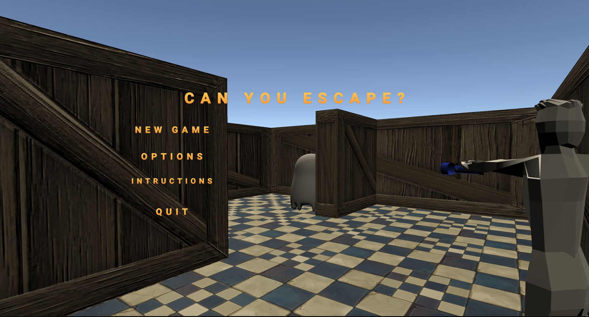
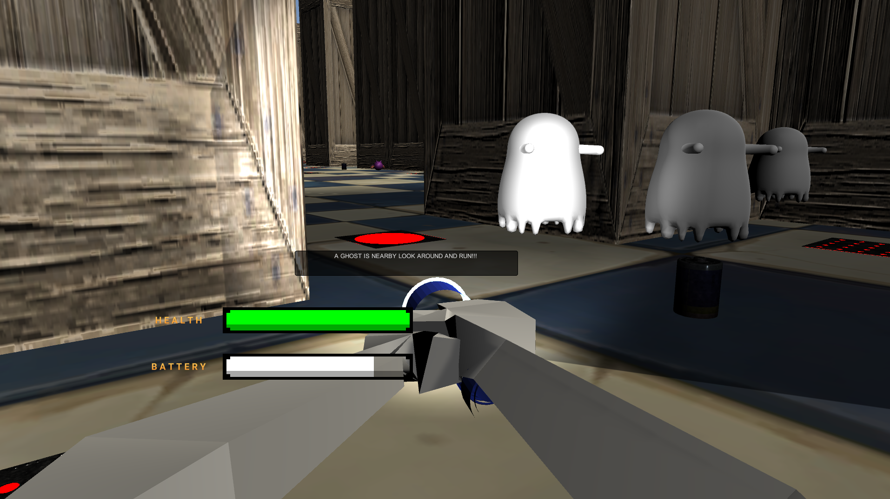
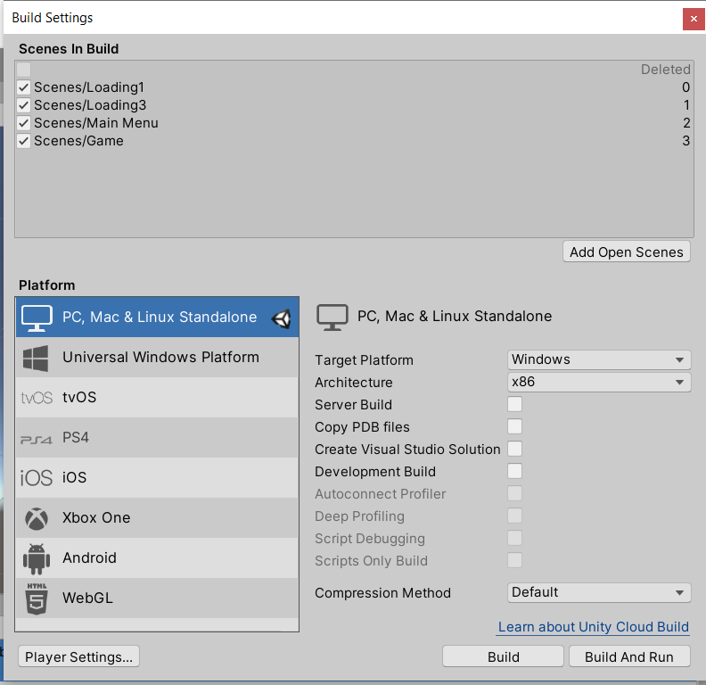
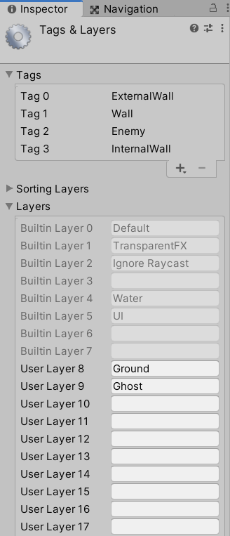

# 3D Unity Game : CanYouEscape

## Team memebers:
* [Jiye Choi](https://github.com/jiyechoi02)
  - Enemies : Bat & Mummy - Bat.cs, Pumpkin.cs, Mummy.cs, Rock.cs
  - Traps : slow & damage the health - Trap.cs
  - End Gate - End.cs : End the game / display the menu 
  - Sound : bat,mummy, collectable, taps

* [Thinh Pham](https://github.com/thinhphamcs)
  - Enemy: Ghost - GhostAI.cs
  - Collectables: healthpacks.cs, batteries.cs
  - Main Menu UI.
  - Player’s UI logic (FirstPersonController.cs)
  - Flashlight UI and and logic (Flashlight.cs)
  - Sound: for ghost “booo”

* [Dylan Callahan](https://github.com/sixbrigands)
  - The procedural level builder, BuildLevel.cs
  - spawns obstacles/enemies/collectables
  - checks for solvability and constraints enemy spawns

## Game Description:

- This game is a 1st peson perspective 3D game to escape a maze. The goal of this game is to escape a randomly generated maze, avoiding attack from enemies. The game allows the player to use a flashlight to get rid of enemies, and also the player needs to find a battery for the flashlight. 

- Game instructions
  - the player use their mouse cursor and keyboard to move.
   - WASD to move
   - shift + w to run
   - move mouse to move camera 
   - space to jump
   - click left mouse to the flash light on 

- Enemies description 
  - Bat : chases the player, projectiles to the player and stuns when the flash light is on it. 
  - Mummy : chases the player, projectiles to the player and stuns when the flash light is on it.
  - Ghost : three of ghosts chase the player and make sounds.

- Traps description
  - Slow trap : Decrease the player’s speed for few sec.
  - Damage trap: Damages the player’s health.

- collectables description
  - battery pack : fill batter of the player's flashlight.
  - health pack : fill the player's health.

- [Demo video link](https://drive.google.com/file/d/1GYxZxxf4Nr0Q-PXPDZbSw14BKRE-MJ6a/view?usp=sharing)

## Setting 
- Please make sure you download all of prefabs. If there is missing prefabs, you can download them from [Unity Asset Store](https://assetstore.unity.com/). 
  * [Bat](https://assetstore.unity.com/packages/3d/characters/free-monster-bat-158125)
  * [mummy](https://assetstore.unity.com/packages/3d/characters/free-mummy-monster-134212)
  * [traps](https://assetstore.unity.com/packages/3d/props/interior/dungeon-floor-traps-77765)
  * [pumkin, rock](https://assetstore.unity.com/packages/3d/environments/fantasy/halloween-cemetery-set-19125)

- In order to build the game application, please make sure the setting as following image.

